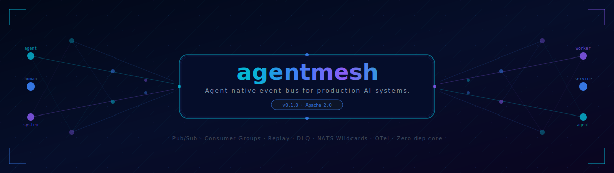

<div align="center">
  
</div>

<div align="center">

[](https://github.com/naveenkumarbaskaran/agentmesh/actions/workflows/ci.yml)
[](https://pypi.org/project/agentmesh-py/)
[](https://pypi.org/project/agentmesh-py/)
[](LICENSE)

</div>

---

**agentmesh** is the event bus built for production AI agents. Kafka moves bytes. AgentMesh moves meaning — every event carries tenant, trace, causality chain, and publisher type.

## Install

```bash
pip install agentmesh-py                    # zero-dep core
pip install "agentmesh-py[redis]"           # Redis Streams transport
pip install "agentmesh-py[kafka]"           # Kafka transport
pip install "agentmesh-py[all]"             # everything
```

## Quickstart

```python
import asyncio
from agentmesh import AgentMesh, AgentEvent

async def main():
    mesh = AgentMesh()
    await mesh.start()

    @mesh.subscribe("order.*")
    async def handle(e: AgentEvent) -> None:
        print(f"[{e.tenant_id}] {e.event_type}: {e.data}")

    await mesh.publish("order.created",
        data={"order_id": "ORD-001", "amount": 299.99},
        publisher_id="billing-agent",
        session_id="sess-001", run_id="run-001",
        tenant_id="acme",
    )
    await asyncio.sleep(0.1)
    await mesh.close()

asyncio.run(main())
```

## Why AgentMesh

| | Kafka / Redis | AgentMesh |
|---|---|---|
| Tenant isolation | Manual | ✓ Built-in |
| Trace propagation | Manual | ✓ Automatic |
| Causality chain | None | ✓ `caused_by_event_id` |
| Human publishers | No concept | ✓ First-class |
| Zero-dep start | Needs server | ✓ `pip install`, run |
| 14 event categories | Raw bytes | ✓ Typed taxonomy |
| Always persistent | Config required | ✓ Default on |

## Features

- **NATS wildcards** — `order.*`, `*.failed`, `acme:>`, `>`
- **Consumer groups** — `group="workers"`, one handler per event
- **Full replay** — `async for e in mesh.replay("order.created")`
- **Human publishers** — `publisher_type="human"` is first-class
- **Request/reply** — `await mesh.request(...)` for HITL flows
- **Dead letter queue** — per-topic, configurable `max_retries`
- **Idempotency** — `event_id` dedup (default 24h window)
- **Server-side filters** — `filter={"data.amount": {"$gt": 1000}}`
- **Topic pause/resume** — queue events, flush on resume
- **OTel native** — spans + metrics, Grafana/Datadog/Honeycomb

## Stack

```
agentmesh       → event bus        connects agents, humans, systems
agentplane      → control plane    runtime policy, versioning, escalation
agenthooks      → extensibility    hookpoints, customer hooks
AgentGuard      → safety           injection, PII, jailbreak
agentregistry   → discovery        publish, version, deploy agents
agenteval       → quality          golden, adversarial, policy tests
```

---

Apache 2.0 · [Docs](https://naveenkumarbaskaran.github.io/agentmesh/) · [PyPI](https://pypi.org/project/agentmesh-py/)


```bash
pip install agentmesh-py
```
